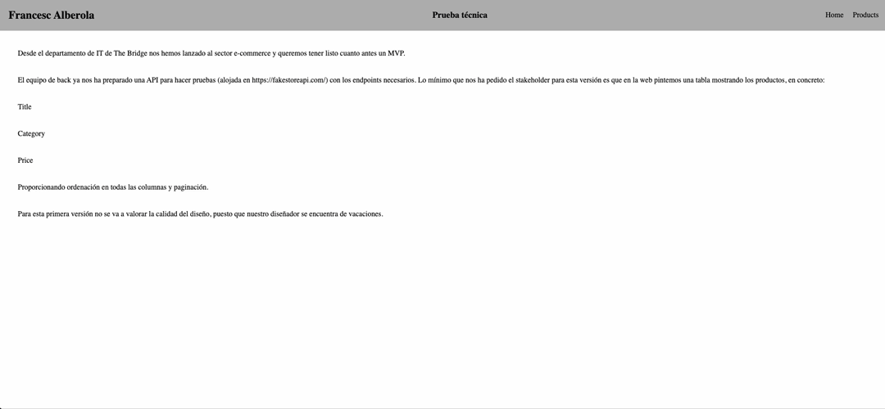

# Technical Test - E-commerce

This project is part of a technical test for The Bridge's IT department, aimed at developing an MVP for an e-commerce website using Angular.

## Description

The main goal of this initial version is to implement a web interface that connects to an API provided by The Bridge's backend team. The API is hosted at https://fakestoreapi.com and offers the necessary endpoints to retrieve product information.

## Stakeholder Requirements

For this initial version of the MVP, the stakeholder has requested the following:

- Display a table on the web interface.
- The table should contain the following columns:
  - Title
  - Category
  - Price
- Enable sorting on all columns.
- Implement pagination for the list of products.

It's important to note that, for this version, the design quality will not be evaluated due to the absence of the designer, who is currently on vacation.

## Technologies Used

- Angular: Framework used for front-end development.
- API: We will utilize the API provided by https://fakestoreapi.com/.

## Preview

  

